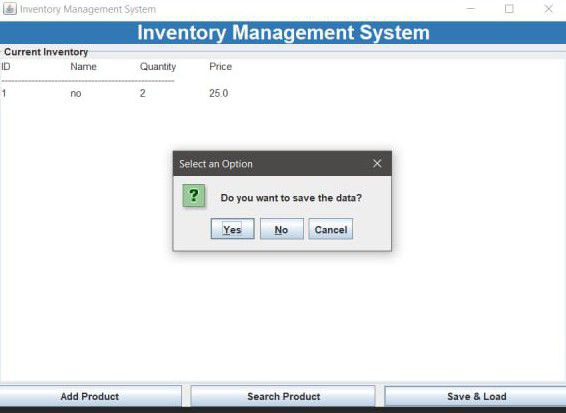
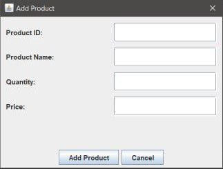
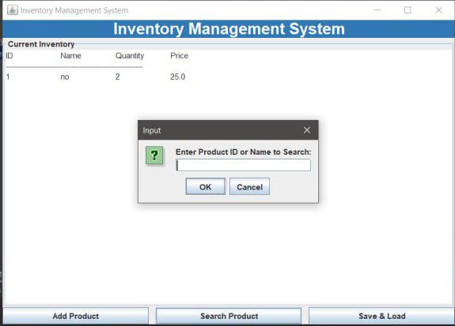
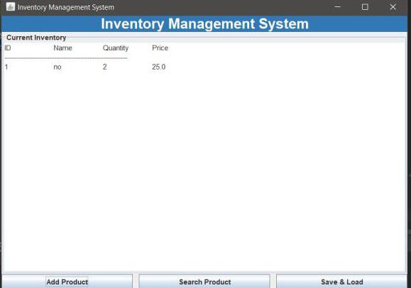

# Inventory Management System
## Overview
The Inventory Management System is a desktop application built using Java Swing. It provides an easy-to-use interface for managing inventory data, including adding, searching, saving, and loading product information.

# Features:
- Add new products with details like ID, name, quantity, and price.
- Search for products by ID or name.
- Save inventory data to a file for persistent storage.
- Load inventory data on startup or from a saved file.
- User-friendly GUI built with Java Swing.

## Requirements
- Java 8 or higher.
- A Java IDE (e.g., IntelliJ IDEA, Eclipse, NetBeans) or a terminal to compile and run the program.
## How to Run
1. Clone the Repository:
```bash
git clone https://github.com/mech-kal/InvintoryManagementSystem.git
```
2. Navigate to the Project Directory:
```bash
cd InventoryManagementSystem
```
3. Compile the Program:
```bash
javac InventoryManagementSystem.java
```
4. Run the Program:
```bash
java InventoryManagementSystem
```
### Usage
1. Add Product:
   - Click on the "Add Product" button.
   - Enter the product details (ID, Name, Quantity, Price).
   - Click "Add Product" to save the product to the inventory.
2. Search Product:
   - Click on the "Search Product" button.
   - Enter the product ID or name to search.
   - If found, the product details will be displayed.
3. Save and Load Inventory:
   - Click the "Save & Load" button.
   - You will be prompted to save the current inventory data.
   - You can also load previously saved inventory data.
4. View Inventory:
   - The main window displays all current inventory items, showing their ID, Name, Quantity, and Price.
# File Structure
   ```bash
 
   InventoryManagementSystem/
   ├── InventoryManagementSystem.java  # Main application file
   ├── Product.java                    # Product class definition
   └── inventory.dat                   # Serialized inventory data (generated after saving data)
```
## Example Workflow
   1. Launch the application.
   2. Add new products by entering the required details.
   3. Search for a product using its ID or name.
   4. Save the inventory data to a file (inventory.dat).
   5. Close and reopen the application to load the saved inventory data automatically.
   
## Future Improvements
   - Add support for deleting and updating product details.
   - Implement sorting and filtering options for the inventory.
   - Add error handling for invalid inputs.
   - Enhance the UI with more styling and features.


## Screenshots




